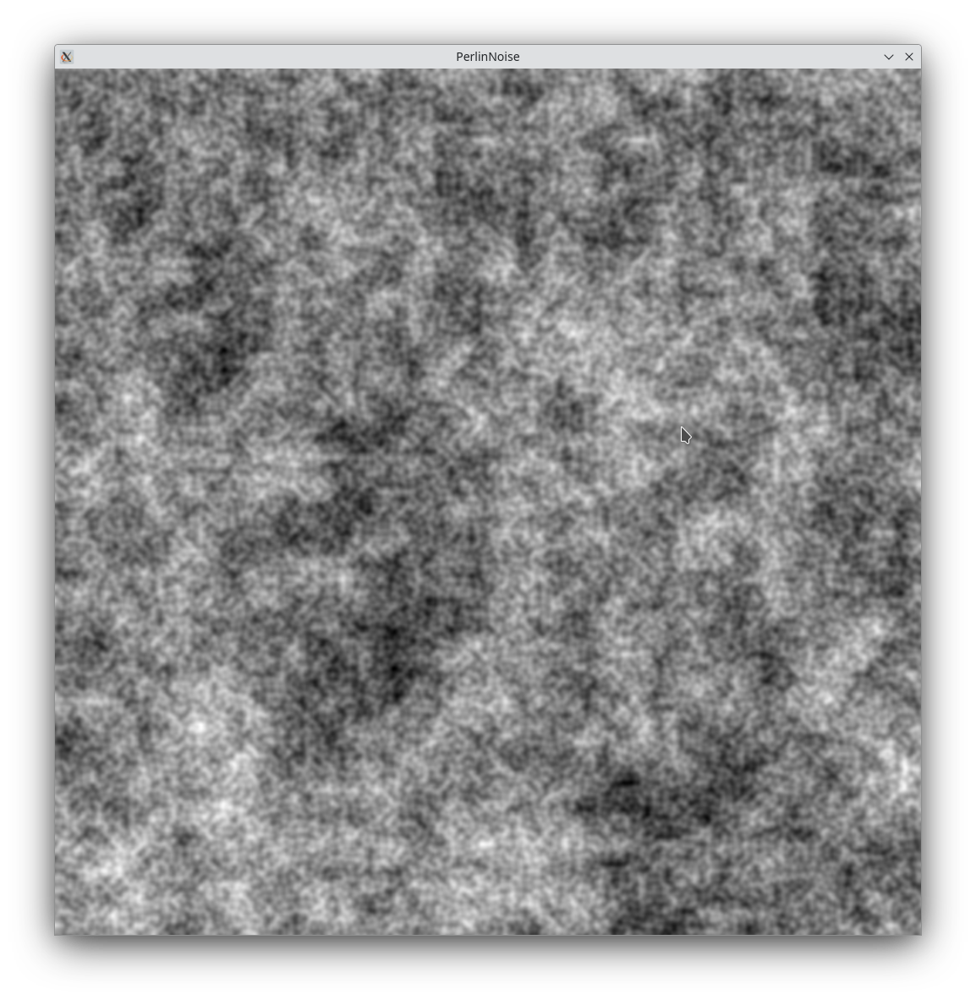
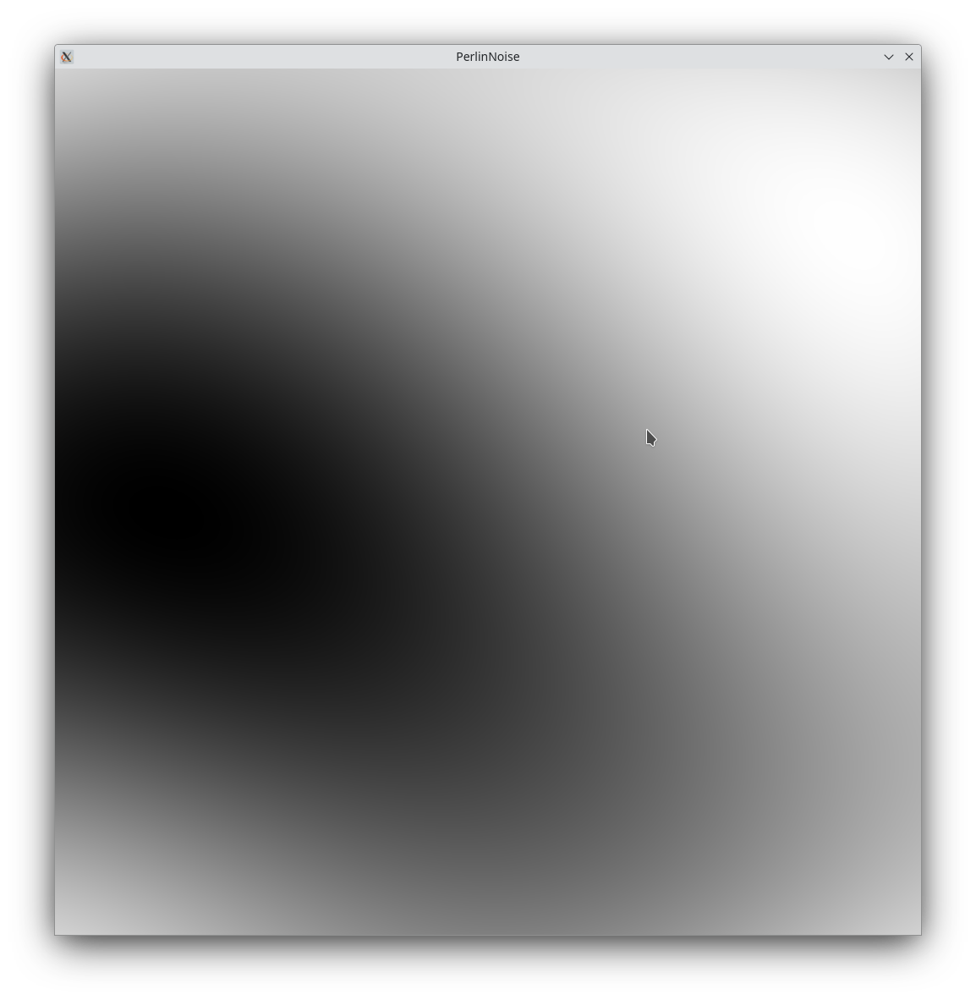
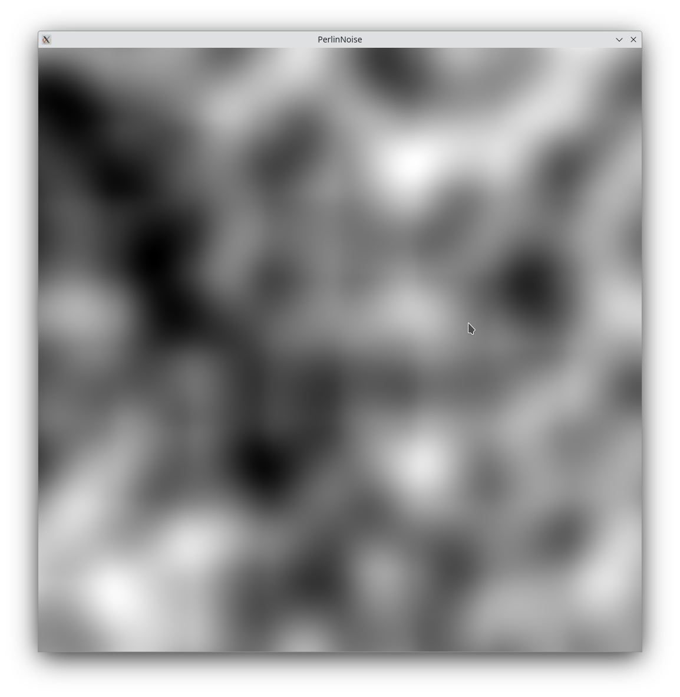
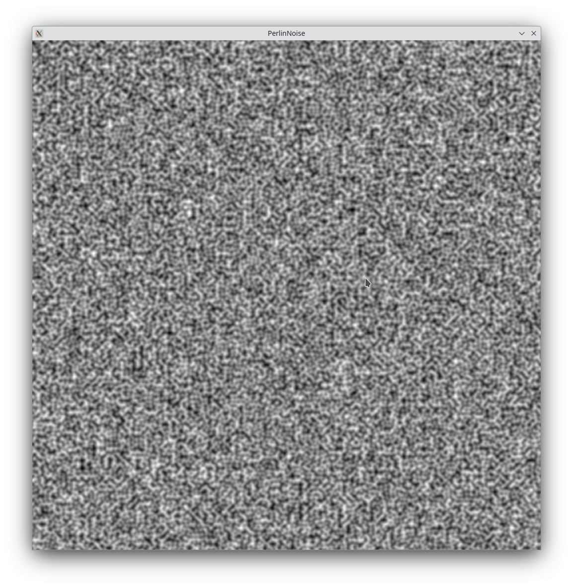

# Perlin Noise Image Generator

## Technology
This project uses the C language and the MinilibX graphics library for Linux to generate images using Perlin noise. Perlin noise is a type of gradient noise developed by Ken Perlin in 1983. It is widely used in computer graphics for effects such as fire, smoke and clouds, as well as to simulate natural phenomena such as the distribution of hair on an animal or the shape of a mountain range.


## How it Works
The program generates a 2D array of noise values using the Perlin Noise algorithm, then maps these values to a range of colors to create an image. The result is a smoothly varying, non-repeating image that can be used for textures, height maps for terrain generation, or any place where you need interesting random data.


## Input explanation:
```bash 
./perlinDisplay <Seed> <Octave> <Persistence> <Lacutarity>
Seed: The seed is a starting point used in generating the random pattern of Perlin Noise. It determines the initial configuration of the noise, and the same seed will produce the same pattern each time it's used. Changing the seed will result in a different pattern.
Octave: Octaves are used in the generation of fractal Perlin Noise. Each octave represents a layer of noise, with higher octaves adding finer details to the overall noise pattern. By combining multiple octaves, you can create more complex and detailed noise patterns.
Persistence: Persistence controls how quickly the amplitude of each successive octave diminishes. It determines the contribution of each octave to the overall noise. Higher persistence values result in more influence from higher octaves, leading to more detail in the generated noise.
Lacunarity: Lacunarity determines the frequency multiplier between successive octaves. It controls the rate at which the frequency increases with each octave. Higher lacunarity values result in faster frequency increases between octaves, leading to more detailed and "zoomed-in" noise patterns.
```

## Example
Here's an example of an image generated with this program:

### Input ./perlinDisplay 42 8 1 2 


### Input ./perlinDisplay 12345 8 1.0 2.0


### Input ./perlinDisplay 42 1 1 2 (One octave)


### Input ./perlinDisplay 42 4 1 2 


### Input ./perlinDisplay 42 8 2 2 


