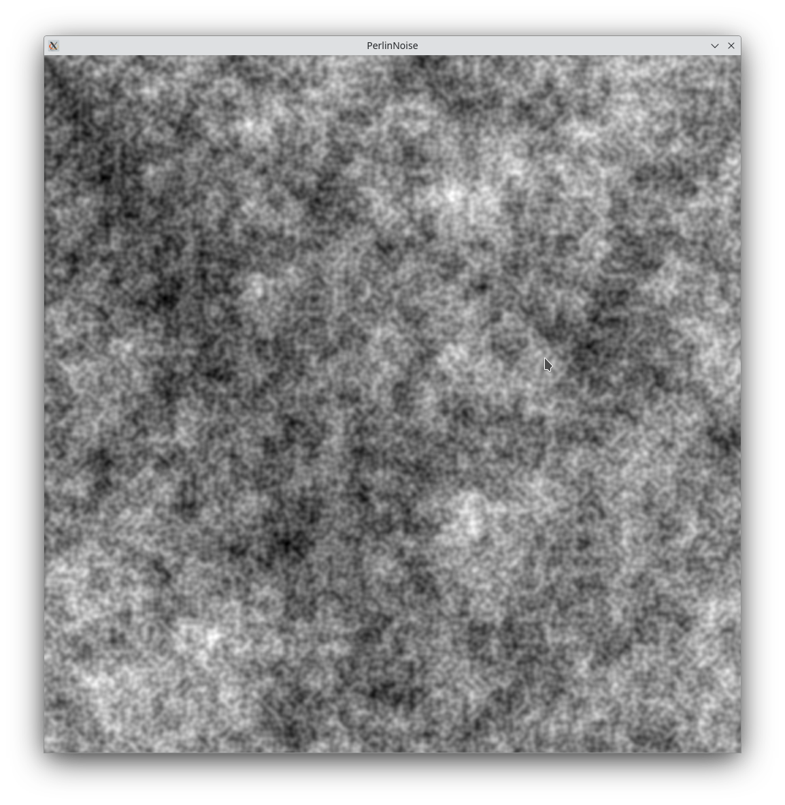

# Perlin Noise Image Generator

This project uses Perlin Noise to generate unique, interesting images. Perlin Noise is a type of gradient noise developed by Ken Perlin in 1983. It's widely used in computer graphics for effects like fire, smoke, and clouds, and to simulate natural phenomena like the distribution of hairs on an animal or the shape of a mountain range.

## How it Works

The program generates a 2D array of noise values using the Perlin Noise algorithm, then maps these values to a range of colors to create an image. The result is a smoothly varying, non-repeating image that can be used for textures, height maps for terrain generation, or any place where you need interesting random data.

## Example

Here's an example of an image generated with this program:

### Seed: 42, octave 8 , persistence 1.0, lacutarity 2.0

